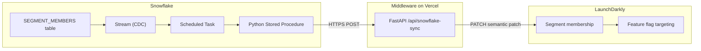

# Snowflake to LaunchDarkly Segment Sync

Sync segment membership from Snowflake tables to LaunchDarkly segments in near real-time. When you add, remove, or update members in a Snowflake table, those changes are automatically pushed to LaunchDarkly so your feature flags can target the right users.

## Architecture



**How it works:**

1. You manage segment membership in a Snowflake table (`SEGMENT_MEMBERS`).
2. A Snowflake Stream detects inserts, updates, and deletes on that table.
3. A Snowflake Task checks the stream every minute. When changes exist, it calls a Python stored procedure.
4. The stored procedure queries for changed members, batches them, and POSTs to the middleware.
5. The middleware translates the payload into a LaunchDarkly semantic patch API call that adds or removes segment targets.

## Prerequisites

- **Snowflake** account with `ACCOUNTADMIN` role (or equivalent privileges)
- **LaunchDarkly** account with an API key that has write access to segments
- **Vercel** account (free tier works) for deploying the middleware, or any Python hosting platform
- **LaunchDarkly segment** already created in your project (standard segment, not a synced segment)

## Quick Start

### 1. Deploy the middleware

The middleware is a lightweight FastAPI app that sits between Snowflake and LaunchDarkly. Snowflake can't call the LaunchDarkly API directly because the semantic patch format differs from the Snowflake payload format, and storing API keys in Snowflake is not ideal.

**Deploy to Vercel:**

```bash
# Clone and deploy
npm i -g vercel
vercel --prod
```

**Set environment variables** in Vercel (or your hosting platform):

| Variable | Description |
|----------|-------------|
| `LD_API_KEY` | LaunchDarkly API key with segment write access |
| `LD_PROJECT_KEY` | Your LaunchDarkly project key |
| `LD_ENV_KEY` | Your LaunchDarkly environment key (e.g. `production`) |

See `env.example` for a template.

### 2. Create segments in LaunchDarkly

Before syncing, create the target segments in LaunchDarkly:

1. Go to **Segments** in your LaunchDarkly project.
2. Click **Create segment**.
3. Give it a key that matches what you'll use in Snowflake (e.g. `premium-users`).
4. Choose a standard segment (not "Big segment" unless you have 15,000+ members).

### 3. Set up Snowflake

Run the SQL scripts in order from a Snowflake worksheet. Each script is self-contained and idempotent.

```
snowflake/01_setup.sql            -- Database and schema
snowflake/02_network_access.sql   -- Allow outbound HTTPS to middleware
snowflake/03_tables.sql           -- SEGMENTS, SEGMENT_MEMBERS, SYNC_LOG
snowflake/04_sync_procedure.sql   -- Python stored procedure (sync engine)
snowflake/05_task.sql             -- Stream + scheduled Task (automation)
snowflake/06_seed_data.sql        -- Example seed data (reference only)
```

**Before running, update these values:**
- `01_setup.sql` -- warehouse name (`USE WAREHOUSE ...`)
- `02_network_access.sql` -- middleware host in `VALUE_LIST`
- `05_task.sql` -- warehouse name and middleware URL in `CALL SYNC_ALL_SEGMENTS(...)`

### 4. Test it

Once the scripts are run and seed data is loaded, trigger a manual sync:

```sql
SET SYNC_URL = 'https://your-middleware.vercel.app';
CALL SYNC_SEGMENT_TO_LD('premium-users', $SYNC_URL);
```

Then check the `premium-users` segment in LaunchDarkly to see the 10 members appear.

## How Segment Membership Works

### Tables

| Table | Purpose |
|-------|---------|
| `SEGMENTS` | One row per segment. Tracks key, name, context kind, sync version, and last sync time. |
| `SEGMENT_MEMBERS` | One row per context-in-segment. `IS_ACTIVE` drives include vs. remove. |
| `SYNC_LOG` | Append-only audit trail of every sync attempt. |

### CRUD Operations

| Operation | SQL | What gets sent to LaunchDarkly |
|-----------|-----|-------------------------------|
| **Add** a member | `INSERT INTO SEGMENT_MEMBERS (SEGMENT_KEY, CONTEXT_KEY) VALUES (...)` | Added to segment (included) |
| **Remove** a member | `UPDATE SEGMENT_MEMBERS SET IS_ACTIVE = FALSE, UPDATED_AT = CURRENT_TIMESTAMP() WHERE ...` | Removed from segment (excluded) |
| **Re-add** a member | `UPDATE SEGMENT_MEMBERS SET IS_ACTIVE = TRUE, UPDATED_AT = CURRENT_TIMESTAMP() WHERE ...` | Added back to segment (included) |

### Change Detection

The sync procedure uses timestamp-based diffing:
- Each member row has an `UPDATED_AT` timestamp.
- Each segment tracks `LAST_SYNCED_AT`.
- On sync, only members where `UPDATED_AT > LAST_SYNCED_AT` are sent.
- On the first sync (no `LAST_SYNCED_AT`), all active members are included.

### Automatic Syncing

The Snowflake Task (`05_task.sql`) uses a Stream to detect changes:
- A Stream on `SEGMENT_MEMBERS` captures all inserts, updates, and deletes.
- The Task runs every minute but only executes when the stream has data.
- This means no wasted compute when nothing has changed.

To enable automatic syncing:
```sql
ALTER TASK SYNC_SEGMENTS_TASK RESUME;
```

### Batching

The LaunchDarkly API allows up to 1,000 context keys per request. The stored procedure automatically splits large payloads into batches.

## Adapting for Your Own Use Case

1. **Define your segment** in the `SEGMENTS` table:
   ```sql
   INSERT INTO SEGMENTS (SEGMENT_KEY, SEGMENT_NAME, CONTEXT_KIND)
   VALUES ('my-segment', 'My Segment', 'user');
   ```

2. **Populate members** from your own tables:
   ```sql
   INSERT INTO SEGMENT_MEMBERS (SEGMENT_KEY, CONTEXT_KEY)
   SELECT 'my-segment', user_id
   FROM my_analytics.active_users
   WHERE some_criteria = TRUE;
   ```

3. **Trigger a sync** (or let the scheduled task handle it):
   ```sql
   CALL SYNC_SEGMENT_TO_LD('my-segment', 'https://your-middleware.vercel.app');
   ```

4. **Create a matching segment** in LaunchDarkly with the same key (`my-segment`).

## API Reference

### POST /api/snowflake-sync

The endpoint the Snowflake stored procedure calls.

**Request body:**
```json
{
  "audience": "premium-users",
  "included": ["user-001", "user-002"],
  "excluded": ["user-003"],
  "version": 1
}
```

**Response:**
```json
{
  "status": "ok",
  "ld_response": "Segment updated successfully",
  "count_included": 2,
  "count_excluded": 1
}
```

### GET /health

Returns `{"status": "healthy"}`.

## Project Structure

```
├── main.py                  # FastAPI middleware (deployed to Vercel)
├── requirements.txt         # Python dependencies
├── vercel.json              # Vercel deployment config
├── env.example              # Environment variable template
├── .gitignore
└── snowflake/
    ├── 01_setup.sql         # Database and schema
    ├── 02_network_access.sql # Network rule + external access
    ├── 03_tables.sql        # Core tables
    ├── 04_sync_procedure.sql # Sync stored procedure
    ├── 05_task.sql          # Stream + scheduled Task
    └── 06_seed_data.sql     # Example seed data
```

## Local Development

```bash
# Install dependencies
pip install -r requirements.txt

# Copy env template and fill in your values
cp env.example .env

# Run locally
python main.py
# Server starts at http://localhost:8000
```

## Troubleshooting

**Snowflake procedure returns `response_code: 404`**
- The segment key in Snowflake must match an existing segment key in LaunchDarkly exactly.
- Verify the segment exists: check LaunchDarkly > Segments.

**Snowflake procedure returns `response_code: 401`**
- Your `LD_API_KEY` is invalid or doesn't have write access to segments.

**Snowflake procedure returns `response_code: 400`**
- The middleware may be outdated. Redeploy and ensure the `Content-Type` header includes `domain-model=launchdarkly.semanticpatch`.

**Task never runs**
- Ensure the task is resumed: `ALTER TASK SYNC_SEGMENTS_TASK RESUME;`
- Ensure data has actually changed in `SEGMENT_MEMBERS` (the stream must have data).
- Check task history: `SELECT * FROM TABLE(INFORMATION_SCHEMA.TASK_HISTORY(TASK_NAME => 'SYNC_SEGMENTS_TASK')) ORDER BY SCHEDULED_TIME DESC LIMIT 10;`

**Members show as "0 targets" in LaunchDarkly UI**
- If you created the segment as a "Big Segment" (list-based, 15,000+), the UI does not display individual targets. Use a standard segment for smaller populations, or verify membership via the LaunchDarkly API.
